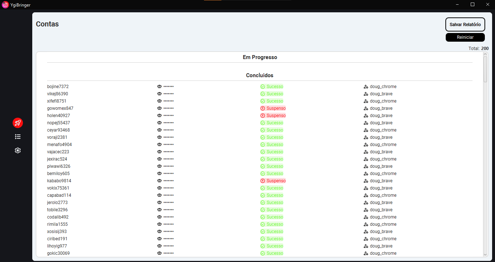
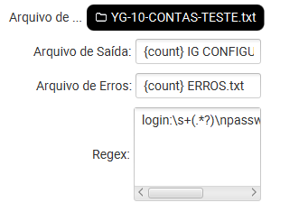
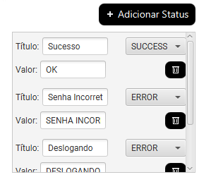
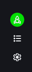
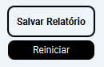

#  YgiBringer

YgiBringer surgiu de uma necessidade pessoal de iterar por uma lista de contas do Instagram para configuração manual.
Ele é uma ferramenta que automatiza uma grande parcela do trabalho.

## Features:

- Status customizados para o uso do agente.
- Filtro de contas repetidas caso um dos status possua o título "repetido(a)" ou "repeat(ed)".
- Status de contas suspensas com valor dinâmico.
- Persistência de estado de contas ao fechar o aplicativo.

## Como usar:

1. Na tela de configurações, selecione o arquivo de entrada, e defina como serão os arquivos de saída. 
 
O formato {count} é a contagem de contas de sucesso ou erro.
Já o campo [regex](https://regexr.com/) vai definir o formato que cada conta segue no arquivo de entrada para leitura.
2. No lado direito da tela de configurações, você pode criar os status que o agente enviará como resposta. É recomendado que o primeiro seja o status de sucesso padrão, pois será a primeira opção que aparece no agente. 

3. Clique no botão verde para iniciar o servidor. 

4. Você pode reiniciar a lista ou salvar o relatório após terminar a lista de contas. O diretório dos arquivos de saída é o mesmo do arquivo de entrada. 

